# Hi there 👋
I'm Rahul Kumar

 

🚀 About Me
* 💻 I’m passionate about **software development / wed develpment**
* 🌱 Currently learning: *Your tech stack (e.g., React, Node.js, AI, etc.)*
* 👯 Looking to collaborate on: 
* 💬 Ask me about **Java, JavaScript, React, C++, C, Pyhton, SQL**
* 📫 Reach me at **[rkrock933@gmail.com](mailto:rkrock933@gmail.com)**
* ⚡ Fun fact: **I debug faster after drinking chai ☕**

---

### 🛠️ Tech Stack

* **Languages:** JavaScript, Python, C++, C, Java, C#
* **Frontend:** React, HTML, CSS, Bootstrap
* **Backend:** Node.js, C++, php, java, C#
* **Tools:** Git, Docker, VS Code
* **Currently Learning:** Swift, Kotlin

---

## Readme File
[Readme](https://github.com/Tech-Codes/readme-games/blob/main/README.md)

---

## 🌐 Connect With Me

---

## ⚡ Fun Fact

> “Programming isn't about what you know; it's about what you can figure out..” 🚀

## 🎮 Contribution Crawl

<picture>
  <source media="(prefers-color-scheme: dark)" srcset="./contribution-crawl-dark.svg">
  <source media="(prefers-color-scheme: light)" srcset="./contribution-crawl-light.svg">
  
</picture>

⭐ From <a href="https://github.com/Tech-Codes">Rahul Kumar</a>

## ✨ Animated Footer...

<!--
**Tech-Codes/Tech-Codes** is a ✨ _special_ ✨ repository because its `README.md` (this file) appears on your GitHub profile.

Here are some ideas to get you started:

- 🔭 I’m currently working on ...
- 🌱 I’m currently learning ...
- 👯 I’m looking to collaborate on ...
- 🤔 I’m looking for help with ...
- 💬 Ask me about ...
- 📫 How to reach me: ...
- 😄 Pronouns: ...
- ⚡ Fun fact: ...
-->
